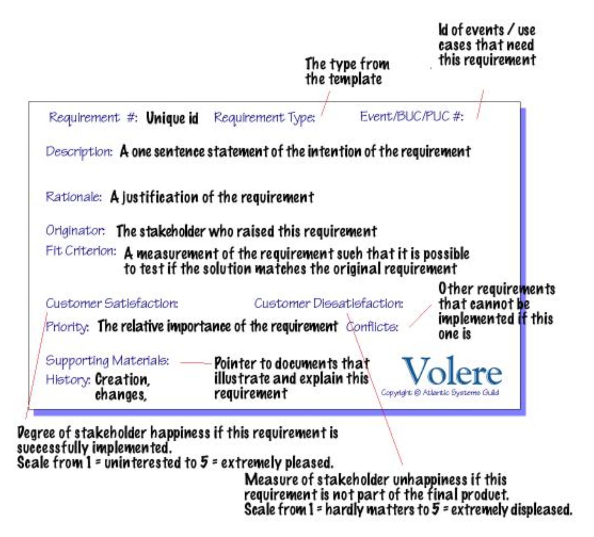
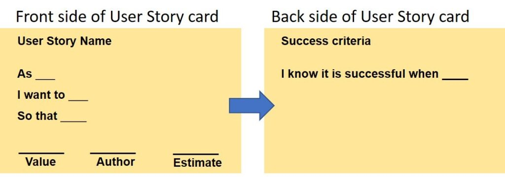

## Requirements and Domain Modelling

To decide what features the software needs, we must gather requirements in collaboration with clients, stakeholders, and other beneficiaries. Requireme/nts describe various aspects of the system, including its behavior, constraints, and other properties.

### Functional Requirements

Functional requirements describe what the product must do, specifying the features needed for a functional product. For example, a system that accepts credit card payments. In contrast, non-functional requirements describe general quality properties of the system, such as usability and performance.

To gather functional requirements, identify the initial high-level use cases of the software. For example, in an online hotel system, use cases could include allowing online booking or online check-in. Functional requirements break down these use cases into smaller units that can be directly implemented and tested, such as enabling a customer to search for available rooms and view details of each room.

Initially, we need to identify core requirements—those with the highest priority for a usable Minimum Viable Product (MVP). To prioritize requirements, the [MoSCoW](https://en.wikipedia.org/wiki/MoSCoW_method) method can be used, labeling requirements as "must have," "should have," "could have," and "won't have."

One way to capture requirements is through user stories, which can be written in this format: As a [role], I want to [feature], so that [reason]. For example, "As a user, I want to be able to do online check-in so that I can save time on arrival."

There are two distinct types of requirements: User and System. User requirements define the product features and can be used to track progress with stakeholders, but they may lack the details needed by developers. System requirements, on the other hand, define the features from a technical perspective, detailing how a feature should be approached, such as "The system shall display available rooms in order from low to high price." However, system requirements should not dictate the specific algorithms or methods developers should use.

### Non Functional Requirements

Non-functional requirements describe the qualities that the system should have, such as being secure, reliable, and fast. An alternative way to think of non-functional requirements is as constraints on the functional ones. For example, a functional requirement might be to allow customers to check in, and the corresponding non-functional requirement would be for this action to complete within 1 second.

A list of non-functional requirements exists to help with choosing what needs to be taken into account when building a project:

**Look-and-feel requirements** concern the general style of the interface. For example: The product shall use only two colors.

**Usability and humanity requirements** measure how easily users can perform tasks with minimal errors, in terms of an intuitive user interface. For example: The system should comply with the Disability Discrimination Act, or it should be possible to pay in different currencies.

**Performance requirements** measure how fast, safe, accurate, available, and reliable all the functionality would be. For example: The product shall handle 10 concurrent users, or the product shall complete the check-in of a user within 1 second.

**Operational and environmental requirements** measure the environment the product should operate under, whether underwater, on top of a mountain, or any other extreme environment, as well as the installation requirements. For example: The product shall be usable up to x meters below sea level, or the product will need to be installed in 100 locations on all continents within 1 month by 10 semi-skilled workers.

**Maintainability** and support requirements specify how easily a product can change and the time it takes to apply those changes. For example: The product shall be operable in operating systems used in our remote branch, or the product shall comply with any new law requirements occurring about every 6 months.

**Cultural requirements** specify the appropriate tone and formalities of the interface depending on the region the product operates in. For example: The pictures shown for the UAE region should not display any exposed bodies.

**Legal requirements** specify all the legal requirements the product must comply with, such as country-specific regulations like the EU GDPR and any other product-specific regulations that should apply for that country. For example, a medical product should not sell products to people under 18 years old. These requirements should be consulted by specialized lawyers.

**Security requirements** specify the security and confidentiality of the product. Note that requirements do not specify exact technologies and specific implementations but rather the general approach needed to secure the product. Security requirements can be broken down into different categories to help cover all aspects:

  * *Access*: Authorized users can access their data.

  * *Privacy*: Authorized users can view only their data and no one else's.

  * *Integrity*: Data does not get corrupted.

  * *Audit*: Any chosen action can be traced back for analysis.

  * *Immunity*: The product is protected against hacking attacks.

### Representing the requirements

Requirements can be formally represented in numerous ways, we will explore the [Volere template](https://www.cs.uic.edu/~i440/VolereMaterials/templateArchive16/c%20Volere%20template16.pdf) and the agile representation.

Firstly we need a small introduction to fit criteria. A software product needs to conform to its requirements, in other words, to be tested against its requirements - conformance testing.
A fit criterion is a precise testable statement of a requirement.

A fit criterion for a functional requirement needs to be written in such a way you can tell whether or not the product satisfies the requirement. For example, the system shall accept a credit card number for a client.

A fit criterion for a non-functional requirement needs to be expressed in terms of some measurable quantity. For example, the credit card number should be accepted securely.

**Volere template**

The Volere template has 5 main sections, *Project drivers*, which are the main reasons and motivations of the project. *Project constraints*, are the restrictions and limitation we want to impose to the product. *Function requirements*, *Non-functional requirements*, *Project Issues* are concerns brought to light during requirement gathering. They help clarify requirements further.

**Agile representation**

Requirements in an Agile way are usually represented with user stories. User stories typically written in cards do not capture the entire requirement the same way the volere template does. Any constraints or notes can be written at the back of the card, and acceptance criteria will determine what is needed to implemented to satisfy the user story.

