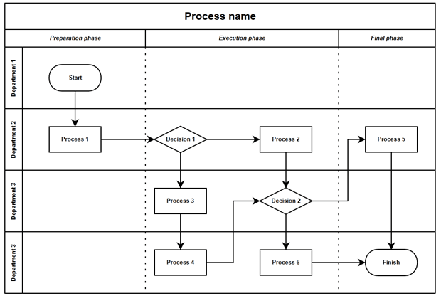

## Domain Modelling

**Business rules** and **business processes** are required to be understood in order to start designing our project.
Business rules reflect the way the business works, independently of any new system being introduced in that business domain. Business processes define what is done in the business, by whom and with what consequences.

For example in a lending book company we could extract these business rules,

- There is a limit in the number of books a member can take out.
- Late returns incur a fine.

And these business processes,

- Issue a book
- Return a book

Business rules need to be *verified* and *validated* to ensure the solution is correctly developed and satisfies the business requirements. Verification can be performed automatically to ensure that the rules match what is developed. Validation can be performed by stakeholders to confirm that the rules meet the business needs.

We will explore how different business processes, rules, and scenarios can be modeled with UML and specific descriptions.

### Activity Diagrams

Business processes can be represented as [UML Activity Diagrams](https://en.wikipedia.org/wiki/Activity_diagram). Activity diagrams help us understand the business situation before any decisions are taken about the software solution and its boundaries. They model the behavioural aspect of the domain.

Notable design blocks for activity diagrams (not a full list):

 - **Start/End nodes**: The start node is where the diagram begins (initial state), and the end node is where it ends (final state). They are represented by filled circles.
 - **Activities**: These are the main building blocks of activity diagrams, shown as rounded boxes. They represent each process as an isolated task.
 - **Transitions**: These go hand in hand with activities. They are the arrowed lines connecting the activities. Each activity will have an incoming and an outgoing transition. The end of an activity will transition to the start of the next.
 - **Synchronization bars**: These are denoted by thick black horizontal lines. The upper bar indicates a *fork*, and the lower one a *join*. This means activities within the synchronization bars can run in parallel, and at the end, they will all have to complete (join) before the next activity, outside the bars, can start.
 - **Decision nodes**: When there are two or more alternative paths an activity might take (like an if statement), a decision node can denote that. They are represented as diamond shapes, and the *guards* (their boolean pathways) are written inside square brackets on their outgoing transitions.
 - **Merge nodes**: Every decision node's outgoing transitions *must* converge in a merge node. A merge node is represented the same way as a decision node, as a diamond.
 - **Swimlanes**: With activity diagrams, we might want to represent different roles or different services of the product. We can design that distinction with swimlanes, where a bordered, titled column can represent each role. Each activity will belong within that columned section, and each transition can go from one role to the other.

### Use case models

