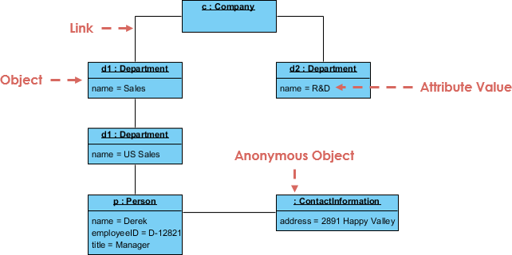
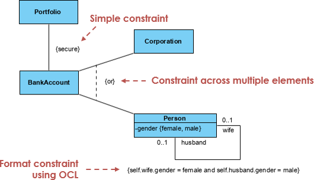

## Analysis

After understanding the business context, we now need to start thinking about the actual structure of the solution by using conceptual models and analysis models. Models are built for communication; therefore, they should be clear for the intended audience.

Agile principles stress that modeling is not the ultimate goal, software is. Thus, models should be light and simple rather than complete and complex. Draw models when they are of use, and they should be easy to modify and adapt.

### Domain Structural Models

To build domain structural models, also known as *conceptual models*, we need to identify objects from the problem domain that may be relevant to the software solution.

Here is a list of categories that may help identify such objects. This list is just for guidance; more categories could be used:

* **Tangible objects** are the actual physical things of the domain, such as rooms, bills, vehicles, etc.

* **Roles** are the different roles that people in the domain might have, such as employee, cleaner, receptionist, etc.

* **Business transactions** are the actions that take place in the domain, such as room reservations, room cleanings, orders, etc.

* **Organizational units** are the groups to which people belong, such as accounts, IT departments, maintenance crews, etc.

* **Grammatical parse** is another way to identify objects by parsing the problem domain (use cases) and extracting a list of nouns and verbs. Nouns usually represent the tangible objects of the domain, and verbs represent the actions.

When we have a list of objects at hand, we need to do some filtering and remove objects of no use for our modeling, such as objects with different names but the same concept. We should also exclude objects that are not important or independent enough and could be expressed as an attribute rather than an object, and objects not relevant to the domain or beyond the scope of the system.

**Object Models**

Object models represent one specific configuration of the system - a **snapshot** of the system at one instant in time. Unlike class models, which indicate which classes are in the system and the associations between those classes, object models can uncover some interesting points of the system, so it is worth exploring if there is a need.

In technical terms, object models show the instances of the classes (objects) at runtime, with specific state values and associations at a specific point in time. Object models can be represented with UML [object diagrams](https://en.wikipedia.org/wiki/Object_diagram).

**Class Models**

A class model can be represented with UML [class diagrams](https://en.wikipedia.org/wiki/Class_diagram). Class diagrams represent what all possible instances of the class have in common, rather than the particular values of any given instance—unlike object models. The main purpose of class diagrams is to represent the information that exists in the problem domain. They show key concepts as classes, their properties as attributes of those classes, and their relationships as associations.

**Constraining models**

In a domain, there can be additional information such as [constraints](https://www.uml-diagrams.org/constraint.html) that we need to capture. *Constraints* can be expressed in natural language or using special UML notation. *Invariants* are specified rules that must always be true in a system, and constraints ensure that the invariants are not violated.

Constraints can be applied to the value of attributes, to associations, and as uniqueness constraints.

Constraints can also be expressed formally in an [Object Constraint Language (OCL)](https://en.wikipedia.org/wiki/Object_Constraint_Language).

