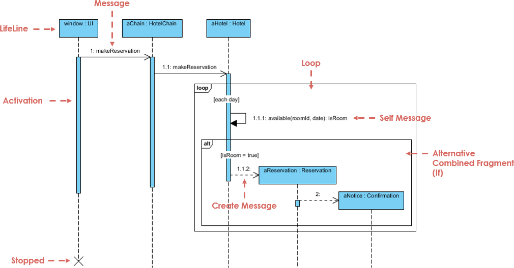
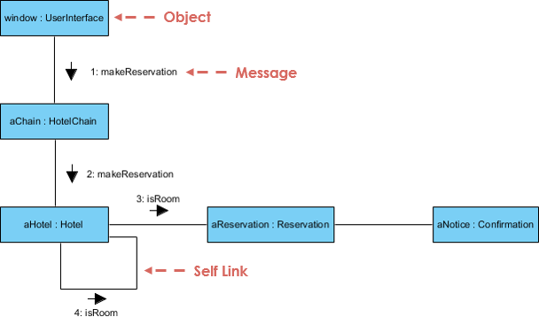
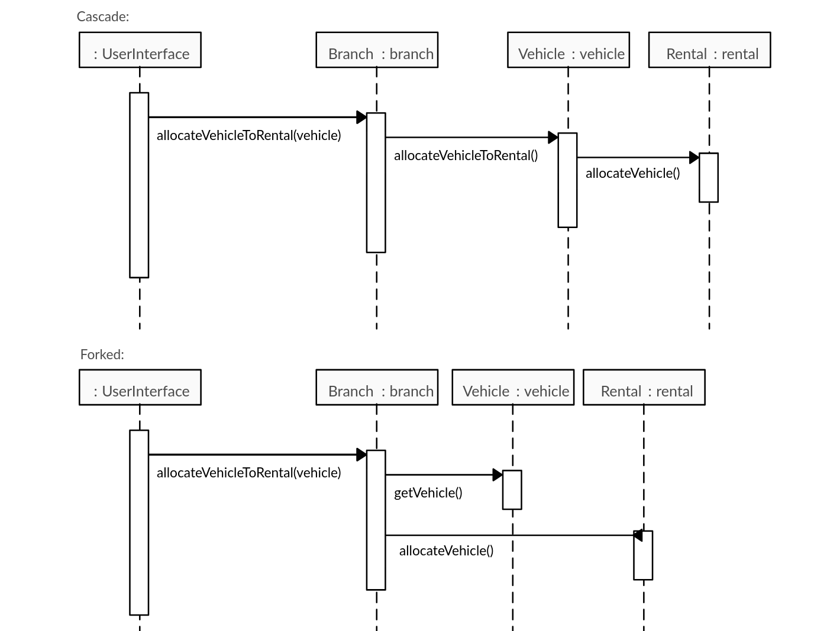

## Design

After the initial analysis and breakdown of the problem - dealing with *what* needs to be captured - we now need to start thinking about *how* we will implement the solution. Remember, all the steps and designs are not necessary for a software project; we can pick and choose which portions of the problem we want to design, such as a complicated feature, to aid with shared understanding.

### Design by contract

Object-oriented design (OOP) works because it uses real-world objects to build systems. This makes it easier to understand, as we all use this concept subconsciously in our everyday lives, e.g., a car and its parts, such as the engine and doors.

Objects implemented in the design phase can differ from those conceptualized in the analysis models.

As in the real world, contracts form a legal binding by an entity towards another, ensuring that it will perform its duties as laid out in the contract. Similarly, in OOP, the [design by contract (DbC)](https://en.wikipedia.org/wiki/Design_by_contract) approach involves designing objects with a similar contract in mind. A sender/client object sends a message to a receiver/server object, expecting a result back as long as both parties conform to the predefined expectations. If either party does not conform to these expectations, the contract is broken and the service is not supplied. These expectations are in the form of preconditions and postconditions.

Preconditions: what is needed for an operation to be allowed to start?

Postconditions: what will have happened as a result of this operation?

Example: The withdrawing functionality of a banking system could have the following contract.

Precondition: There must be sufficient funds in the account to permit the operation without exceeding the overdraft limit

Postcondition: The account will have been debited the requested amount.

Both of those conditions (contract) will have to be met for the withdrawl to take place.

### Dynamic modelling

So far we have focused on the static modelling of the system, we will now explore the [dynamic modelling](https://www.geeksforgeeks.org/dynamic-modelling-in-object-oriented-analysis-and-design/), which show how the objects interact by sending messages to each other, implementing the required functionality of the system.

To start designing the software solution, we need to have in mind the main design principles that make a good software product, such as encapsulation, low coupling and high cohesion. There are many design patterns that fit better for different situations that could be applied effectively with experience. Even though there are many design patterns that provide general guidance on how to build a product, there are some more practical principles that help solve design problems, [general responsibility assignment software patterns (GRASP)](https://en.wikipedia.org/wiki/GRASP_(object-oriented_design))

Notable *GRASP* principles:

- **Creator** - Creator pattern is a design principle used in object-oriented design to determine which class should be responsible for creating instances of another class. According to this pattern, a class should create an instance of another class if it contains, aggregates, closely uses, or has the initializing data for that object. This helps to ensure that object creation responsibilities are assigned in a way that supports clear and maintainable code, reducing dependencies and promoting encapsulation.

- **Expert** - According to this pattern, a class that has the necessary information to fulfill a task should be the one to carry it out. In other words, the "expert" on a particular piece of information or functionality should be responsible for handling it. This ensures that tasks are assigned to the classes best suited to perform them, leading to more cohesive and maintainable code. By following the Expert Pattern, developers can create systems where responsibilities are logically distributed and encapsulated within the appropriate objects.

**Sequence Diagrams**

A [sequence diagram](https://en.wikipedia.org/wiki/Sequence_diagram) in OOP visually represents the interactions and order of messages between objects over time. It shows how objects collaborate to achieve a specific functionality by depicting the sequence of method calls and the flow of information between them. The diagram typically includes objects represented by lifelines, horizontal arrows indicating messages, and vertical lines showing the passage of time. This helps in understanding the dynamic behavior of the system and the interactions among its components.

**Class-responsibility-collaboration cards**

[CRC (Class-Responsibility-Collaboration) cards](https://en.wikipedia.org/wiki/Class-responsibility-collaboration_card) are a brainstorming tool used in object-oriented design to help conceptualize and organize the components of a system. Each CRC card represents a class and is divided into three sections:

1. **Class**: The name of the class.
2. **Responsibilities**: The duties or functions the class must perform.
3. **Collaborations**: Other classes with which the class interacts to fulfill its responsibilities.

By physically manipulating these cards, designers can explore different design scenarios, understand class interactions, and ensure that responsibilities are appropriately distributed among classes. CRC cards promote a hands-on, collaborative approach to system design, better suited when the solution is not complex and can be expressed simpler.

**Communication diagrams**

[Communication diagrams](https://en.wikipedia.org/wiki/Communication_diagram), also known as collaboration diagrams, are used in object-oriented design to illustrate the interactions between objects in a system, focusing on the structural organization of these objects and their relationships. Unlike sequence diagrams, which emphasize the order of messages over time, communication diagrams highlight the network of objects and the flow of messages among them.

In a communication diagram, objects are represented as rectangles, and their links (or associations) are depicted as lines connecting these rectangles. Messages exchanged between the objects are shown as arrows on these lines, often numbered to indicate the sequence of interactions. This type of diagram helps in understanding how objects collaborate to perform a specific task and is useful for visualizing and designing the communication pathways within a system.

**Levels of detail**

Interaction diagrams should include enough detail for a programmer to understand the goal to be achieved. There is no single correct level of detail, but it is a common mistake to include more detail than necessary. You should focus only on the higher-level abstraction of the classes and their interfaces, not on implementation details. The primary purpose of these diagrams is for a team to share the same mental model. Adding more details can make the diagrams harder to understand.

Other uses of interaction diagrams could be to show a particular operation of a class, such as *subcommunication*. For example, they can explain how the findAFreeRoom operation works for the Hotel class. They can also illustrate how a design pattern works, such as the *strategy pattern*.

### More on design decisions

The Fork and Cascade pattern is a design pattern used in object-oriented programming to manage the delegation of tasks and the propagation of method calls across multiple objects. This pattern helps in organizing and simplifying complex interactions among objects by dividing responsibilities clearly.

**Fork Pattern**
In the Fork pattern, an object delegates tasks to multiple subordinate objects simultaneously. Each subordinate object performs its part of the task independently. This pattern is useful when an operation can be divided into parallel or independent subtasks that can be executed concurrently.

**Cascade Pattern**
In the Cascade pattern, an object delegates a task to another object, which in turn delegates part of the task to yet another object, and so on. This creates a chain of responsibility where each object in the cascade performs a part of the overall task. This pattern is helpful for operations that require a sequence of steps, with each step depending on the outcome of the previous one.

**Example**

Consider a scenario in a hotel management system:

- **Fork Pattern**: When a guest checks in, the system might fork tasks such as updating the room status, notifying housekeeping, and generating an invoice simultaneously.
- **Cascade Pattern**: When processing a booking, the system might first validate the booking details, then check room availability, and finally confirm the booking, with each step dependent on the previous one.

By using the Fork and Cascade patterns, complex tasks can be broken down into manageable subtasks, enhancing the clarity and maintainability of the system.

**The Law of Demeter**

The Law of Demeter, also known as the principle of least knowledge, is a design guideline for developing software, particularly in object-oriented programming. It suggests that a given object should have limited knowledge about other objects and should only communicate with closely related objects. This principle helps to reduce dependencies between components, promoting loose coupling and enhancing the maintainability and flexibility of the system.
Key Points of the Law of Demeter

Direct Interaction: An object should only call methods on:

* Itself.
* Objects passed as arguments to its methods.
* Objects it creates.
* Its direct component objects (i.e., its own fields).

Avoid Chain Calls: An object should avoid calling methods on objects returned by other methods, often referred to as "method chaining" or "train-wreck" calls. For example, instead of a.getB().getC().doSomething(), the object should interact directly with its immediate collaborators.

*Benefits*

Reduced Coupling: By limiting the interactions between objects, the system becomes less interdependent, making it easier to change one part of the system without affecting others.
Increased Encapsulation: Objects hide their internal structure and only expose necessary functionality, leading to better encapsulation.
Improved Maintainability: With reduced dependencies and better encapsulation, the codebase becomes easier to understand, modify, and maintain.
