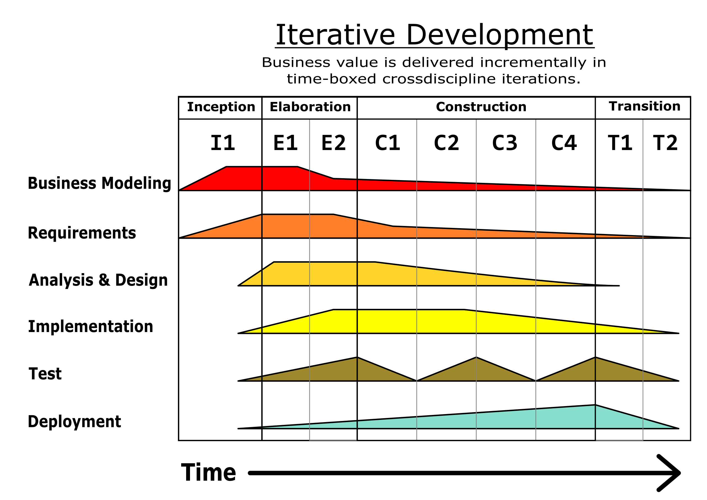

# Software Engineering

A summary on how to approach the creation of a software project "by the book", from the initial conception to the actual implementation. Following the [Unified Process (UP)](https://en.wikipedia.org/wiki/Unified_Process) for building object oriented, iterative and incremental enterprise software using [UML](https://en.wikipedia.org/wiki/Unified_Modeling_Language). Focused only on the first 4 steps, requirements, domain modelling, analysis and design.

**Table of content**
1. [Requirements](./01-requirements.md)
    - [Functional requirements](./01-requirements.md#functional-requirements)
    - [Non-Functional requirements](./01-requirements.md#non-functional-requirements)
    - [Representing requirements](./01-requirements.md#representing-the-requirements)
2. [Domain modelling](./02-domain-modelling.md)
    - [Activity diagrams](./02-domain-modelling.md#activity-diagrams)
    - [Use case models](./02-domain-modelling.md#use-case-models)
3. [Analysis](./03-analysis.md)
    - [Domain Structural models](./03-analysis.md#domain-structural-models)
4. [Design](./04-design.md)
    - [Design by contract](./04-design.md#design-by-contract)
    - [Dynamic modelling](./04-design.md#dynamic-modelling)
    - [More on design decisions](./04-design.md#more-on-design-decisions)
    - [State machines](./04-design.md#state-machines)
